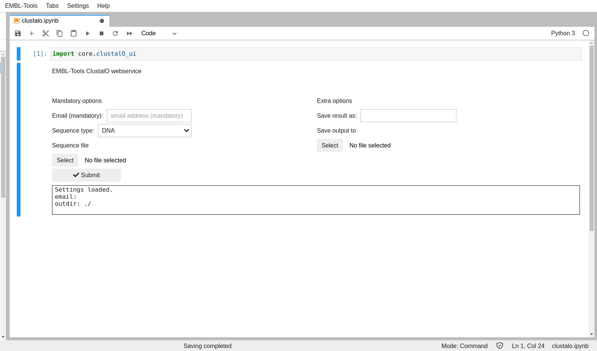

# EMBL Tools Jupyter Notebooks

### Copyright (c) 2020, Dr. Nandor Poka

### Distributed under the terms of the 3-clause BSD License.

Simple ui for EMBL webservices based on Jupyter Notebooks and ipywidgets.

Uses work from: 

Fábio Madeira, Young mi Park, Joon Lee, Nicola Buso, Tamer Gur, Nandana Madhusoodanan, Prasad Basutkar, Adrian R N Tivey, Simon C Potter, Robert D Finn, Rodrigo Lopez, The EMBL-EBI search and sequence analysis tools APIs in 2019, Nucleic Acids Research, Volume 47, Issue W1, 02 July 2019, Pages W636–W641, https://doi.org/10.1093/nar/gkz268
## Preview

## How to contribute

Use the `core/_template_ui.py` as starting point. Make a copy of it and extend it with widgets for the service you wish to provide UI for. The EMBL python client files reside in `embl_client`.